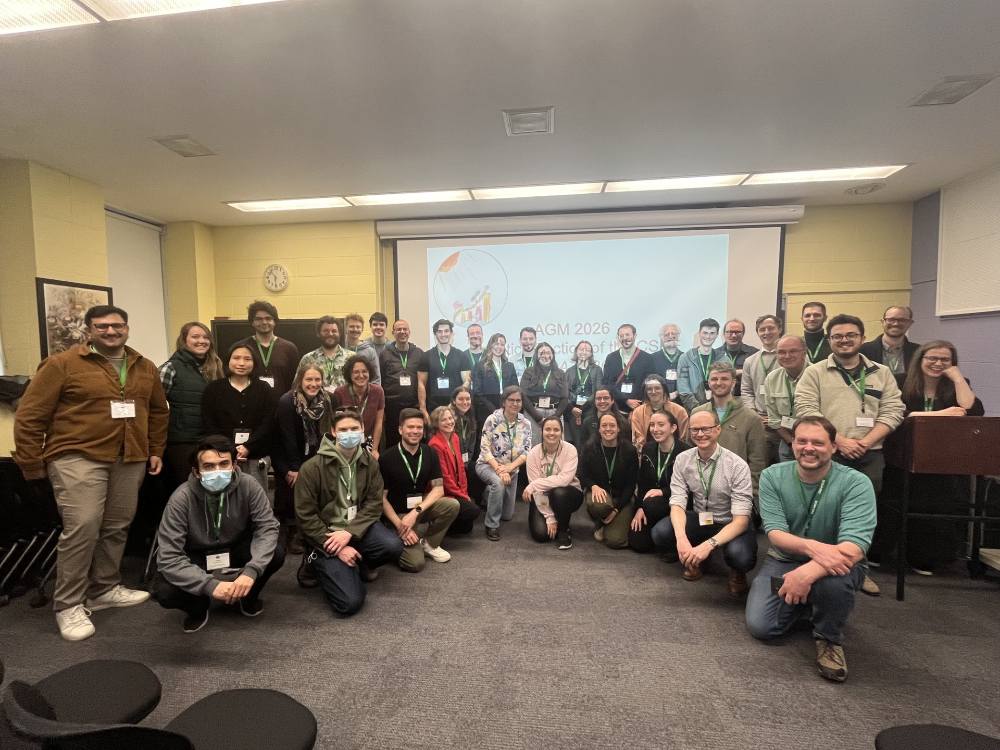

### AGA inaugurale & réception ([Minutes](documents/minutes_2026_agm.pdf))

{fig-alt="AGA 2026"}

Notre première assemblée générale annuelle (AGA) aura lieu lors de la prochaine conférence annuelle de la SCEE à Toronto et sera suivi d'une réception. L'événement aura lieu de 17 h à 19 h le 13 mai dans les [Ramsay Wright Laboratories](https://maps.app.goo.gl/d7SBVUoZSyV8cgJ48), salle 432 (RW432). L'AGA devrait durer \~30 minutes. Des boissons non-alcooliques et des amuse-gueules seront offerts pendant cette réception.

Veuillez remplir le [formulaire d'inscription en ligne](https://forms.office.com/pages/responsepage.aspx?id=TaaTrQ2tzU6y_eU84VllvszQaMmxRBlKsiRQ_S3EMoFUOU9LMUcwTkIxMFRLNzJVWDJZQTJBMzYzOC4u&route=shorturl) si vous souhaitez y participer. 
